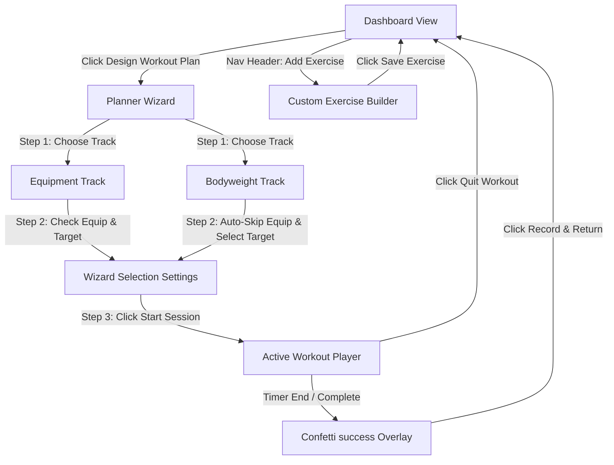
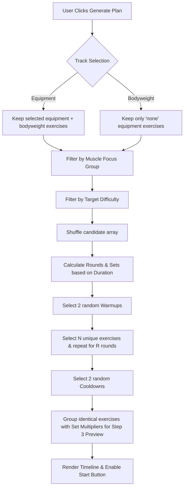
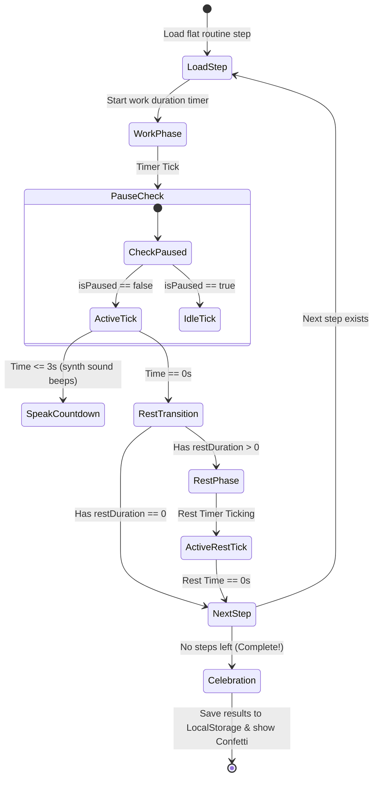

# FlexiFit — Premium Personal Workout Planner

FlexiFit is a modern, responsive Single Page Application (SPA) designed to build, customize, and track workout routines. It supports both **Equipment Workouts** (leveraging Machines, Dumbbells, Barbells, Kettlebells, and Elastic Bands) and strict **Bodyweight Workouts** (requiring no training tools).

---

## 🌟 Key Features

1. **Interactive Dashboard & Statistics**: Track total completed workouts, active training minutes, and estimated calories burned. Features a dynamic 7-day calendar tracking workout streaks.
2. **Setup Wizard (Workout Planner)**: A guided 3-step setup to tailor workouts by track, available equipment, target muscle groups, total duration, and difficulty ratings.
3. **Grouped Exercise Timelines**: Generates structured warmup, active core sets, and cooldown timeline reviews. Groups repeated exercises across rounds using multiplier badges (e.g., `Standard Push-Ups (x3 Sets)`) for clean visual layout.
4. **Active Session Workout Player**: A full-screen workout interface featuring:
   - **Visual circular SVG progress rings** that change colors between active sets (purple), rests (cyan), warmups (amber), and cooldowns (emerald).
   - **Web Audio API Synth Beeps** that count down the final 3 seconds of a set.
   - **Web Speech Text-to-Speech (TTS) Voice Coaching** announcing upcoming exercises and active phases.
   - Play, pause, skip, and backward controllers.
5. **Custom Exercise Builder**: Inject custom exercise blocks directly into the local database with step-by-step instructions.
6. **Data Persistence**: Synced entirely with browser `localStorage`.

---

## 🗺️ Workflows & Flow Diagrams

### 1. Navigation Flow (SPA Routing)
This diagram maps how pages transition within the application:



### 2. Workout Generation Algorithm
The logic flow for selecting and structuring exercises based on user requirements:



### 3. Active Session Player State Machine
How the workout timer handles active sets, intervals, and phase transitions:



---

## 📁 Project Architecture

The workspace is organized into a lightweight, static client structure:

```
d:/Capstone Project/
├── index.html        # Main template, layouts, forms, and custom modals
├── style.css         # Deep dark neon CSS Variables, animations, and grid classes
├── data.js           # Static database of pre-defined exercises, warmups, and cooldowns
├── app.js            # Main JS logic, router, timers, sounds, and localStorage trackers
└── README.md         # Comprehensive project guide and flowcharts
```

---

## 🚀 Running Locally

Because the project is written in pure vanilla HTML, CSS, and Javascript, it does not require complex npm build processes or webpack compilation. 

### Method 1: Serving via Local Web Server
To enjoy standard file loading and prevent browser-level CORS warnings for scripts, serve the directory locally:
- **Using Python**:
  ```bash
  python -m http.server 8080
  ```
- **Using Node/npm**:
  ```bash
  npx http-server -p 8080
  ```
Navigate to `http://localhost:8080` in your web browser.

### Method 2: Native PowerShell Server (No Dependencies)
If you don't have Python or Node in your path, run our included PowerShell server script:
```powershell
powershell -ExecutionPolicy Bypass -File C:\Users\devyo\.gemini\antigravity-ide\brain\a9500b65-989f-418c-83cb-c9b2301c4198\scratch\server.ps1
```
This launches a native web listener serving the files on `http://localhost:8080/`.

---

## 🛠️ Technology Stack
- **Structure**: HTML5 Semantic markup
- **Styling**: Vanilla CSS3 Custom Variables, Flexbox/CSS Grid, and Keyframe Animations
- **Confetti Engine**: Custom Canvas 2D frame-by-frame renderer
- **Audio Synthesizer**: Web Audio API (real-time oscillation beeps)
- **Voice Coaching**: Web Speech Synthesis API
